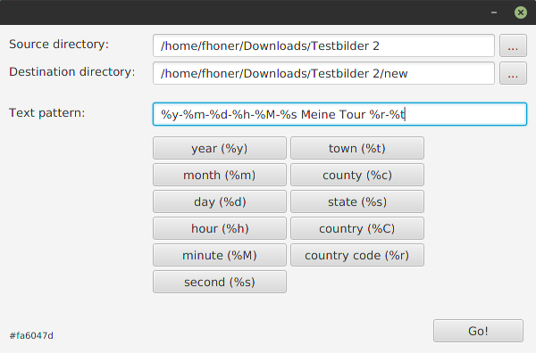
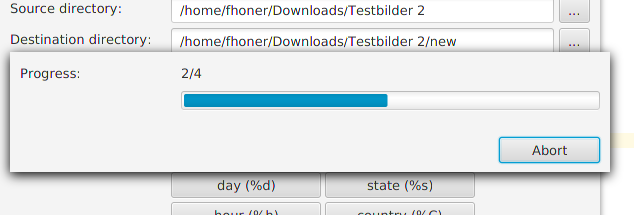
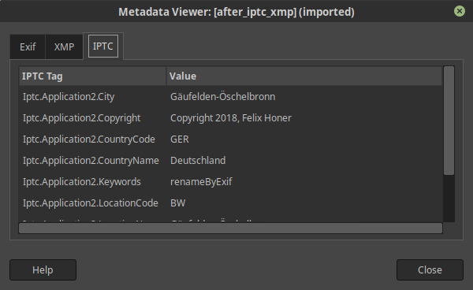

# Exifrename 
Rename and tag your JPEG files by defining your own filename pattern based on exif metadata:
* translates gps coordinates to address information
* writes geo metadata in IPTC and XMP
* renames your files based on your custom naming schema

## Sample

**Pattern:**  
&nbsp;&nbsp;&nbsp;&nbsp;&nbsp;&nbsp;&nbsp;&nbsp;&nbsp;&nbsp;
%y-%m-%d - My fantastic Tour - %t, %C  
**Before:**  
&nbsp;&nbsp;&nbsp;&nbsp;&nbsp;&nbsp;&nbsp;&nbsp;&nbsp;&nbsp;
DCIM_471100.jpg  
**After:**  
&nbsp;&nbsp;&nbsp;&nbsp;&nbsp;&nbsp;&nbsp;&nbsp;&nbsp;&nbsp;
2018-09-22 - My fantastic Tour - Stuttgart, Germany.jpg

### UI
  



### Tags
  
(tags after running, showed by GIMP)

## Requirements
Installed Java 8 Runtime. Runs on
* Windows
* Linux
* macOS

## Notes
### Geo
For getting address information from gps location (so called reverse geocoding) the [OpenStreetMap](https://www.openstreetmap.org/) API is used. As it is for free we don't want to flood their servers, so we built in a limit of one request per second just how it is recommended by OSM.
### Relies on
* [drewnoakes/metadata-extractor](https://github.com/drewnoakes/metadata-extractor)
* [dragon66/icafe](https://github.com/dragon66/icafe)
* [Adobe XMP Toolkit](https://www.adobe.com/devnet/xmp.html)

### Metadata
Your Metadata might be overwritten! Please make sure everything is going on correctly instead of relying on correctness of this tool. Following tags will be (over)written by default:  

Type | Tag                    | Action
-----|:-----------------------|-------:
IPTC | copyright notice       | written
IPTC | location name          | written
IPTC | city                   | written
IPTC | province state         | written
IPTC | country code           | written
IPTC | country name           | written
XMP  | NS_DC/subject          | removed
XMP  | NS_IPTCCORE/CountryCode| written
XMP  | NS_IPTCCORE/Location   | written
XMP  | NS_PHOTOSHOP/City      | written
XMP  | NS_PHOTOSHOP/Country   | written
XMP  | NS_PHOTOSHOP/State     | written

## Build
To build jar from sources use following profiles:<br><br>
build executable javafx jar containing all dependencies:  
```mvn clean install -DwithDependencies```<br><br>  

build .exe for Windows systems:  
```mvn clean install -DwithDependencies -DmakeExe```<br><br>

fast build without tests and dependencies:  
```mvn clean install -DskipTests```
