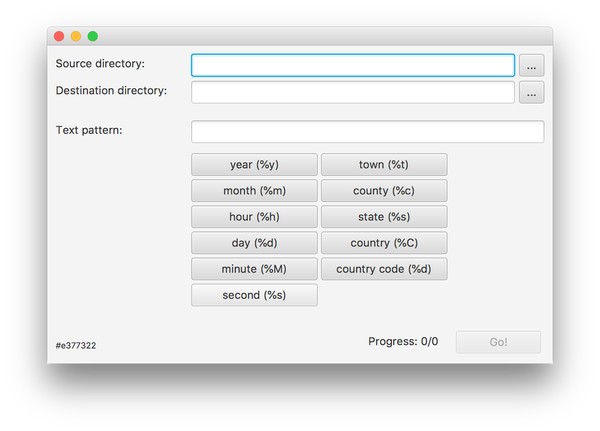

# Rename by EXIF 
Rename your photos based on tagged JPEG files by defining your own filename pattern.
* translate gps coordinates to address information
* datetime of creation

## Sample

**Pattern:** %y-%m-%d - My fantastic Tour - %t, %C  
**Before:** DCIM_471100.jpg  
**After:** 2018-09-22 - My fantastic Tour - Stuttgart, Germany.jpg

## Requirements
Installed Java 8 Runtime.